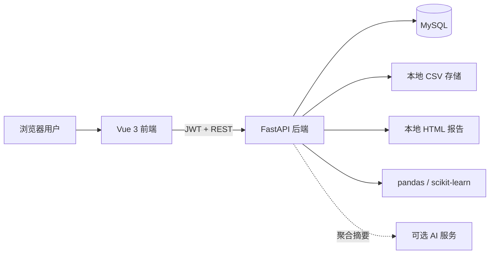

# DataInsight AI

[](https://github.com/Yang-0713/DataInsight-AI/actions/workflows/ci.yml)
[](https://www.python.org/)
[](https://vuejs.org/)
[](LICENSE)

DataInsight AI 是一个开源的本地数据分析平台。用户可以上传 CSV、检查数据质量、完成统计分析与可视化、使用 PCA 和双重异常检测定位可疑样本，并通过 AI 数据分析师生成解释和 HTML 综合报告。

> 当前版本：**0.7.0**；当前进度：**第七阶段——开源发布准备（已完成）**

项目面向学习、原型验证和中小型本地分析任务。当前 `0.x` 版本尚未针对公网生产部署完成安全加固，请在可信环境中运行。

## 文档导航

- [安装与运行指南](docs/installation.md)
- [完整 API 文档](docs/api.md)
- [示例数据说明](examples/README.md)
- [贡献指南](CONTRIBUTING.md)
- [安全策略](SECURITY.md)
- [社区行为准则](CODE_OF_CONDUCT.md)
- [更新日志](CHANGELOG.md)

## 核心能力

### 用户与数据集

- 用户名、邮箱和密码注册
- Argon2 密码哈希与 JWT Bearer 身份认证
- `USER`、`ADMIN` 角色
- 用户私有 CSV 上传、检查、列表、详情和删除
- UTF-8、UTF-8 BOM、GB18030 编码支持
- 本地文件和 MySQL 元数据分离存储

### 自动化 EDA

- 自动识别数值、分类、日期和布尔字段
- 数据规模、缺失值、重复记录和唯一值画像
- 平均值、中位数、标准差、最值和四分位数
- 分类频数和主要类别分布
- 直方图、箱线图、柱状图、相关性热力图和时间趋势
- 分析结果以结构化 JSON 持久化

### 机器学习

- 数值特征自动推荐或手动选择
- 中位数缺失值补全和标准化
- PCA 主成分载荷、解释方差和二维投影
- Isolation Forest 全局异常检测
- Local Outlier Factor 局部异常检测
- 统一的 0–1 异常分数、样本标签和前端复核表

### AI 数据分析师

- 基于最新 EDA 和机器学习摘要进行中文问答
- 没有 EDA 时自动生成聚合上下文
- 安全提示词约束事实、推测和建议的边界
- 默认支持 OpenAI Responses API
- 支持 OpenAI 兼容的 Chat Completions 服务
- 一键生成并下载本地 HTML 综合报告
- 问答和报告继续执行用户级访问隔离

## 系统结构



技术栈：

- 前端：Vue 3、Vite、TypeScript、Element Plus、Pinia、Axios、ECharts
- 后端：Python 3.10、FastAPI、SQLAlchemy、PyMySQL、Pydantic Settings
- 数据分析：pandas、NumPy、SciPy、scikit-learn
- 数据库：MySQL 8+
- AI：OpenAI Responses API 或 OpenAI 兼容服务

项目无需 Docker。

## 快速开始

### 1. 获取代码并创建环境

```powershell
git clone https://github.com/Yang-0713/DataInsight-AI.git
cd DataInsight-AI
conda create -n pythonProject python=3.10 -y
conda activate pythonProject
python -m pip install -r backend/requirements.txt
```

### 2. 初始化数据库

确认 MySQL 已启动：

```powershell
mysql -u root -p --execute="source database/init_db.sql"
```

### 3. 配置并启动后端

```powershell
Copy-Item backend/.env.example backend/.env
cd backend
python -m uvicorn app.main:app --reload --host 127.0.0.1 --port 8000
```

启动前先编辑 `backend/.env`，填写 MySQL 密码和至少 32 个字符的 JWT 密钥。AI 配置是可选的。

### 4. 启动前端

打开另一个终端：

```powershell
cd frontend
npm ci
Copy-Item .env.example .env
npm run dev
```

访问 <http://127.0.0.1:5173>。

更完整的 Windows、macOS、Linux 步骤和故障排除见[安装与运行指南](docs/installation.md)。

## 示例数据

仓库提供一份完全合成的零售数据：

```text
examples/datasets/retail_sales.csv
```

它包含 40 条记录、日期、地区、类别、渠道、多个数值指标、2 个缺失单元格和少量极端记录，适合体验完整流程：

1. 上传示例 CSV。
2. 运行自动 EDA。
3. 选择推荐特征运行 PCA、Isolation Forest 和 LOF。
4. 配置 AI 后询问数据质量或异常样本。
5. 生成 HTML 综合报告。

字段说明见[示例数据文档](examples/README.md)。数据为人工合成，不包含真实个人或企业信息。

## API 概览

后端启动后可访问：

- Swagger UI：<http://127.0.0.1:8000/docs>
- ReDoc：<http://127.0.0.1:8000/redoc>
- OpenAPI JSON：<http://127.0.0.1:8000/openapi.json>

| 模块 | 主要接口 |
| --- | --- |
| 健康检查 | `GET /api/health` |
| 身份认证 | `POST /api/auth/register`、`POST /api/auth/login`、`GET /api/auth/me` |
| 数据集 | `POST /api/datasets/upload`、`GET /api/datasets`、`DELETE /api/datasets/{id}` |
| EDA | `POST /api/analysis/{dataset_id}`、`GET /api/results/{result_id}` |
| 机器学习 | `GET /api/ml/{dataset_id}/features`、`POST /api/ml/{dataset_id}` |
| AI | `GET /api/ai/status`、`POST /api/ai/chat` |
| 报告 | `POST /api/reports/{dataset_id}`、`GET /api/reports`、报告下载 |

除健康检查、注册和登录外，所有接口都需要：

```http
Authorization: Bearer <access_token>
```

请求、响应、状态码和完整调用流程见 [API 文档](docs/api.md)。

## 配置

复制 [backend/.env.example](backend/.env.example) 后按需修改：

| 环境变量 | 说明 |
| --- | --- |
| `DATAINSIGHT_MYSQL_*` | MySQL 连接配置 |
| `DATAINSIGHT_JWT_SECRET_KEY` | JWT 签名密钥，至少 32 个字符 |
| `DATAINSIGHT_DATASET_STORAGE_DIR` | CSV 本地存储目录 |
| `DATAINSIGHT_REPORT_STORAGE_DIR` | HTML 报告本地存储目录 |
| `DATAINSIGHT_MAX_UPLOAD_SIZE_MB` | 单个上传文件上限 |
| `DATAINSIGHT_MAX_ML_ROWS` | 单次机器学习最大记录数 |
| `DATAINSIGHT_OPENAI_API_KEY` | 可选 AI 服务密钥 |
| `DATAINSIGHT_OPENAI_BASE_URL` | OpenAI 或兼容服务地址 |
| `DATAINSIGHT_OPENAI_MODEL` | 模型名称 |
| `DATAINSIGHT_OPENAI_API_MODE` | `responses` 或 `chat_completions` |

`.env` 已被 Git 忽略。请勿提交数据库密码、JWT 密钥、AI 密钥或访问令牌。

## 数据与隐私边界

CSV 默认存储在 `datasets/用户ID/`，HTML 报告存储在 `reports/用户ID/`。这两个目录的运行时内容不会提交到 Git。

启用 AI 功能时，系统只发送：

- 数据集文件名、行数和字段数
- 缺失值、重复值和字段画像
- 描述性统计与分类高频值
- 图表类型、标题和字段说明
- 可选的 PCA 摘要、异常数量和少量异常样本编号

系统不发送完整原始 CSV 或服务器文件路径。分类高频值和样本编号仍可能属于业务数据，接入外部服务前请完成敏感性评估。

## 项目结构

```text
DataInsight-AI/
├── .github/                 CI、Dependabot、Issue 和 PR 模板
├── backend/                 FastAPI API、服务、模型和算法
├── frontend/                Vue 3 Web 应用
├── database/                完整初始化脚本和分阶段迁移
├── docs/                    安装与 API 文档
├── examples/                合成示例数据和字段说明
├── tests/                   后端与示例数据自动化测试
├── datasets/                本地上传文件，运行时内容已忽略
├── reports/                 本地 HTML 报告，运行时内容已忽略
├── CONTRIBUTING.md          贡献流程
├── SECURITY.md              漏洞报告与部署建议
└── CHANGELOG.md             版本变化
```

## 开发验证

后端使用指定的 Python 3.10 环境：

```powershell
conda run -n pythonProject python -m pytest -q
```

前端：

```powershell
cd frontend
npm run type-check
npm run build
```

GitHub Actions 会在推送和 Pull Request 中执行相同的后端、前端检查。

## 开发路线

1. 项目初始化——已完成
2. 注册、登录、JWT 身份认证与用户持久化——已完成
3. CSV 数据集上传、存储和管理——已完成
4. 自动化数据画像、统计分析与可视化——已完成
5. PCA、Isolation Forest 和 Local Outlier Factor——已完成
6. AI 数据分析师与 HTML 报告生成——已完成
7. README、示例数据、API、安装和贡献文档——已完成

后续工作将以 Issue 和版本迭代的方式推进，包括性能优化、更多数据源、导出格式和生产部署加固。

## 参与贡献

提交代码前请阅读 [CONTRIBUTING.md](CONTRIBUTING.md)。普通问题和功能建议可通过 GitHub Issue 提交；安全漏洞请按照 [SECURITY.md](SECURITY.md) 私下报告。

## 开源协议

DataInsight AI 使用 [MIT License](LICENSE)。
